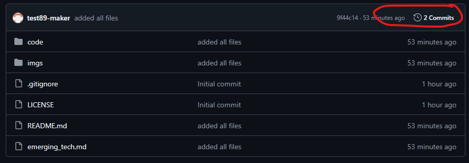

# emerging_tech_arduino

> Voorbeeld repository voor het praktijkgedeelte van het vak `emerging technologies`

- Arduino scripts kan je vinden in [code/arduino](./code/arduino/)
- Python scripts kan je vinden in [code/python](./code/python/)

Afbeeldingen plaats je in [imgs](./imgs/)
Bijv. 

## Bedradingsschema

## indien Project GGO

indien je reeds project GGO hebt, heb je waarschijnlijk al een algemene `README.md`, dan kun je extra documentatie in een aparte markdown file steken zoals hier in [emerging_tech.md](./emerging_tech.md)

## Git basic tutorial

### Doel van de sessie
In deze sessie leren jullie de basisprincipes van Git en GitHub kennen. We gebruiken de Sourcetree applicatie om het proces te vereenvoudigen. Jullie werken in duo's en leren hoe je code kunt beheren, versiebeheer kunt toepassen en kunt samenwerken aan projecten.

#### Wat is Git?
Git is een versiebeheersysteem dat wordt gebruikt om code bij te houden, versies te beheren en samen te werken aan projecten. Het helpt ontwikkelaars om veranderingen in de code bij te houden en samen te werken zonder dat er conflicten ontstaan.

#### Stappenplan

> ! per gedeelte staat er in [] bij of iedereen dit moet doen of 1 persoon van de groep: [IEDEREEN], [1 PERSOON], [SAMEN]
1. Installeer [SourceTree](https://www.sourcetreeapp.com/)
1. Maak een online Git repository aan en kies een gepaste licentie [1 PERSOON]
   > Indien je al een git repository hebt voor project GGO of dit vak, sla deze sectie over
    1. Ga naar GitHub en log in of maak een account aan.
    2. Klik op "New repository" en geef je repository een naam.
    3. Kies een licentie (bijvoorbeeld MIT License) en klik op "Create repository".
       1. Indien je niet weet welke licentie te kiezen: kijk op [tldrlegal.com](https://www.tldrlegal.com/) eens naar de uitleg van `MIT` en `Apache`
2. Clone je repository naar je lokale machine [IEDEREEN]
    > clonen wilt zeggen een lokale kopie te maken op je computer vanop github. Aanpassingen die je hier maakt verschijnen **niet** automatisch op github.
    1. Open Sourcetree en klik op "Clone".
    2. Voer de URL van je GitHub repository in en kies een lokale map om de repository op te slaan.
    3. Klik op "Clone".
3. Sla een Arduino project op in de Git folder [1 PERSOON]
    1. Maak een nieuw Arduino project of gebruik een bestaand project.
    2. Sla het project op in de map die je hebt gecloned.
4. Commit en push je project naar GitHub [1 PERSOON]
    > Indien je tevreden bent met lokale aanpassingen, wil je die online zien te krijgen. Dat doe je door aan te duiden welke bestanden je online wilt updaten (staging), een boodschap te geven opdat je later kunt terugvinden waarom je bepaalde wijzigingen gedaan hebt en dan deze wijzigingen finaal te pushen naar de remote.
    1. Open Sourcetree en selecteer je repository.
    2. Voeg de bestanden van je Arduino project toe aan de staging area.
    3. Maak een commit met een beschrijvende boodschap (bijv. "Initial commit").
    4. Klik op "Push" om je wijzigingen naar GitHub te sturen.
5. Pull de veranderingen van de code [IEDEREEN]
    > jullie werken in groep, iedere keer als iemand aan wijziging doorvoert en pusht naar github, is jouw **lokale** versie niet meer up-to-date. Door te `pullen` update je jouw versie naar de laatst gekende versie op github en werkt eenieder op dezelfde code.
    1. In SourceTree ga je naar je repository
    2. Er zou een cijfer bij `Pull` moeten staan indien jij niet de code gepusht hebt. Klik op die `Pull` om je lokale code up-to-date te brengen.
    3. Nu zou bij iedereen de mapstructuur en de bestanden hetzelfde moeten zijn.
6. Maak aanpassingen aan de Arduino code [1 PERSOON]
    1. Voeg in de code een comment (`//`) toe met de namen van je groep in de Arduino code.
    2. Sla de wijzigingen op.
    3. Commit de wijzigingen met een beschrijvende boodschap (bijv. "Added group names").
    4. Push de wijzigingen naar GitHub.
7. Bekijk de wijzigingen online [IEDEREEN]
    1. Ga naar je GitHub repository en bekijk de commit geschiedenis.
       1. 
       2. klik op commits
          1. Hier zie je de commits die iedereen gemaakt heeft, **met de boodschappen erbij**
          2. klik op de laatst gemaakte commit
          3. in het groen staan je laatste toevoegingen, in het rood wat verdwenen is
    2. Controleer de wijzigingen die zijn doorgevoerd.
8. Pas nu de structuur van je github repository zo aan dat deze [het voorbeeld](https://github.com/devriesewouter89/emerging_tech_arduino) qua structuur volgt, aangepast aan jullie project [SAMEN]