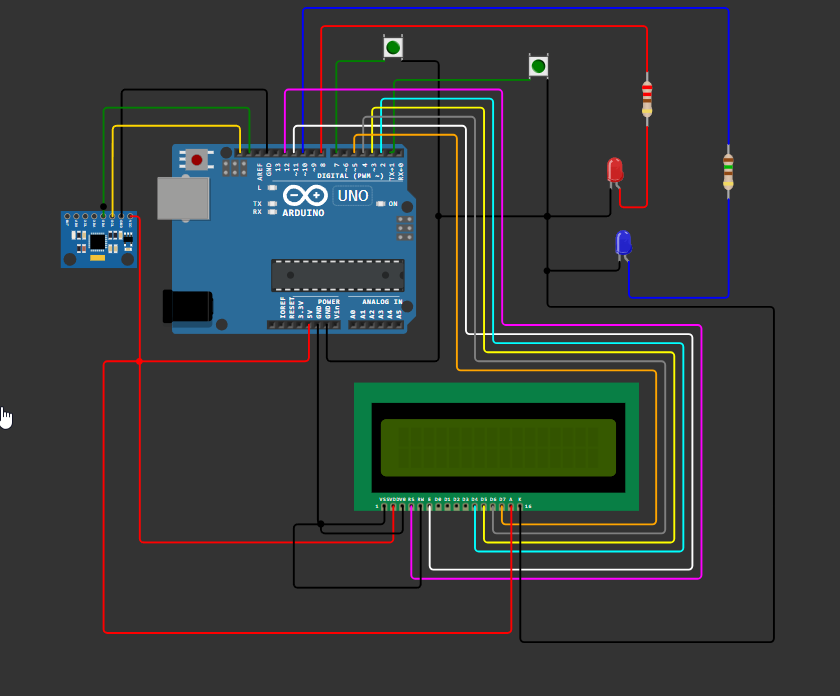

# Loops

Een interactieve, bewegingsgestuurde vlieggame met een Arduino UNO en een MPU6050, gecombineerd met een Processing-sketch voor de gameplay en real-time LED-feedback via een custom controller-behuizing.

## Inhoud

- [Introductie](#introductie)  
- [Doel](#doel)  
- [Opdracht](#opdracht)  
- [Materialen](#materialen)  
- [Aanpak](#aanpak)  
- [Problemen](#problemen)  
- [Resultaat](#resultaat)  
- [Bedrading](#bedrading)  
- [Gebruik](#gebruik)  
- [Controller-behuizing](#controller-behuizing)  
- [Verbeteringen](#verbeteringen)  
- [Licentie](#licentie)

## Introductie

Dit project gebruikt een MPU6050 motion sensor op een Arduino UNO om beweging en oriëntatie van een handcontroller te meten. De data stuurt de Arduino via seriële communicatie naar een Processing-sketch, waarin een vliegtuig in een 3D-wereld bestuurd wordt. Afhankelijk van game-events en streaks (3 events binnen 5 s) licht de Arduino rode of blauwe LEDs op.

## Doel

- Beweging en oriëntatie meten met MPU6050 voor besturing van een vliegsimulator.  
- Game-events omzetten naar LED-feedback:  
  - **Rode LED** bij ringpassage of ring-streak  
  - **Blauwe LED** bij target-hit of target-streak  
- LCD-scherm als scoreboard voor live weergave van behaalde scores.  
- Triggerknop op handgreep voor schieten.  
- Startknop voor game-initiatief.  

## Opdracht

- Maak een motion-based remote controller (wired of wireless) voor software-besturing.  
- Ondersteun minimale functionaliteit: start/stop, versnelling, rotatie en bewegingen.  
- Bied haptische (knoppen) en visuele (LEDs, LCD) feedback.

## Materialen

- Arduino UNO  
- MPU6050 (gyroscoop + accelerometer)  
- Rode LED + 220 Ω weerstand  
- Blauwe LED + 150 Ω weerstand  
- Drukknop (Shoot) + interne pull-up  
- Drukknop (Start) + interne pull-up  
- LCD-scherm (scoreboard)  
- 3D-geprinte controller-behuizing  
- Optioneel breadboard en bedrading  
- USB-kabel  

## Aanpak

Onze workflow verliep in vijf duidelijke stappen, met na elke fase een test om door te gaan naar de volgende:

1. **Concept en sensorkeuze**  
   - Idee geformuleerd: bewegingsgestuurde controller met real-time visuele + haptische feedback  
   - Na lang ICM20600 en AK09918 testen → te veel drift en verbindingsproblemen  
   - Overgestapt naar MPU6050 met `I2Cdev`-library en complementair filter (α = 0.98)  

2. **Prototyping van input**  
   - Breadboard-opstelling: Arduino UNO + MPU6050  
   - Basale sketch: sensorwaarden via `Serial` versturen  
   - Offsetkalibratie bij opstart en validatie met bekende hoeken  

3. **Game-ontwikkeling in Processing**  
   - 3D-vliegtuigmodel en willekeurige ringen/targets  
   - Sensorpitch/roll stuurde vluchtvector en camera  
   - Ringpassage (`R,n`) en target-hit (`T,n`) stuurden feedback naar Arduino  
   - Intro-scherm, HUD, sparkles, bullets en visuele effecten geïmplementeerd  

4. **Integratie hardware-feedback**  
   - Arduino-sketch uitgebreid met `handleEvent()` voor LED-flashes en streak-detectie  
   - LCD toegevoegd voor live scores  
   - Trigger- en startknoppen (`INPUT_PULLUP`) gekoppeld aan `SHOOT`/`START`  

5. **Enclosure-ontwerp en final assembly**  
   - Overgezet in 3D-geprinte behuizing: ergonomische handgreep + trigger-slot  
   - Breadboard vervangen: VCC/GND-pinnen gebundeld met zip ties en solderingen  
   - Male-female jumper wires + kabelbinders zorgden voor stevigere verbinding  
   - E2E test: volledige controller in game, finetuning framerate, debounce en soldeersterkte  

## Problemen

- **Soldeer- en bedradingcomplexiteit**  
  - Direct solderen in van wires leidde tot brekende verbindingen  
  - **Oplossing**: male–female jumper wires met kabelbinders

- **Stroomvoorziening zonder breadboard**  
  - Alle GND-pinnen van LCD, LEDs en knoppen met zip ties gebundeld en aan drie aparte GND-pinnen van Arduino verbonden  
  - VCC-pinnen van LCD en sensor samengebonden, gesolderdeerd in 5V verbonden  
  - **Resultaat**: compact, betrouwbaar en breadboard-vrij  

- **Processing-rendering en performance**  
  - 3D-rendering met dynamische updates veroorzaakte haperingen  
  - **Oplossing**: optimalisatie van `draw()`, culling en 60 FPS-limiet  

- **Score- en UI-integratie**  
  - 2D-scoreboard in 3D-scène niet haalbaar  
  - **Oplossing**: scores via LCD op controller  

- **Knopdebouncing**  
  - Mechanische knoppen veroorzaakten multiple pulsen  
  - **Oplossing**: software-debounce met korte delay en status-tracking  

## Resultaat

- Werkende vlieggame met controller:  
  - Vliegen door ringen en schieten op targets met triggerknop  
  - LED-feedback: **rood** bij ringpassage, **blauw** bij hit, **snelle flash** bij streaks  
- Live score-display op LCD: doorvlogen ringen en hits  
- Custom 3D-geprinte behuizing met ergonomische handgreep  
- Start- en reset-knop voor onbeperkte gameplay  

## Bedrading

— basisbekabeling:  
  - I2C: **A4 (SDA)** → MPU6050 SDA, **A5 (SCL)** → MPU6050 SCL  
  - **8** → Rode LED via 220 Ω → GND  
  - **10** → Blauwe LED via 150 Ω → GND  
  - **7** → SHOOT-knop → GND (`INPUT_PULLUP`)  
  - **1** → START-knop → GND (`INPUT_PULLUP`)   



## Gebruik

- **Arduino → Processing**  
  ```cpp
  Serial.print(pitch, 2);
  Serial.print(",");
  Serial.println(roll, 2);


- **Processing → Arduino**
  ```cpp
  port.write("R," + ringScore + "\n");
  port.write("T," + targetScore + "\n");
  port.write("SHOOT\n");
  port.write("START\n");

Arduino behandelt serial-commando’s met handleEvent() en knoppen via INPUT_PULLUP


## Controller-behuizing

- 3D-geprint om alle componenten te huisvesten  
- Ergonomische handgreep met geïntegreerde triggerknop  
- Netjes weggewerkte bedrading en toegang tot USB/reset  

## Verbeteringen

- Uitbreiding met joystick voor richtoptie, los van vliegrichting  

## Licentie

Dit project is gelicentieerd onder de Apache License 2.0 – zie het `LICENSE`-bestand voor details.  


