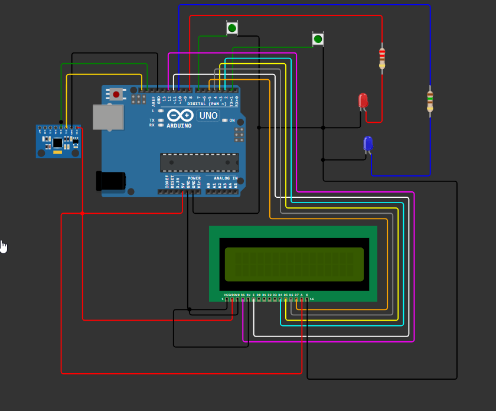

# Loops

Een interactieve, bewegingsgestuurde vlieggame met een Arduino UNO en een MPU6050, gecombineerd met een Processing-sketch voor de gameplay en real-time LED-feedback via een custom controller-behuizing.

## Inhoud

- [Introductie](#introductie)  
- [Doel](#doel)  
- [Opdracht](#opdracht)  
- [Materialen](#materialen)  
- [Aanpak](#aanpak)  
- [Problemen](#problemen)  
- [Resultaat](#resultaat)  
- [Bedrading](#bedrading)  
- [Gebruik](#gebruik)  
- [Controller-behuizing](#controller-behuizing)  
- [Verbeteringen](#verbeteringen)  
- [Licentie](#licentie)

## Introductie

Dit project gebruikt een MPU6050 motion sensor op een Arduino UNO om beweging en oriëntatie van een handcontroller te meten. De data stuurt de Arduino via seriële communicatie naar een Processing-sketch, waarin een vliegtuig in een 3D-wereld bestuurd wordt. Afhankelijk van game-events en streaks (3 events binnen 5 s) licht de Arduino rode of blauwe LEDs op.

## Doel

- Beweging en oriëntatie meten met MPU6050 voor besturing van een vliegsimulator.  
- Game-events omzetten naar LED-feedback:  
  - **Rode LED** bij ringpassage of ring-streak  
  - **Blauwe LED** bij target-hit of target-streak  
- LCD-scherm als scoreboard voor live weergave van behaalde scores.  
- Triggerknop op handgreep voor schieten.  
- Startknop voor game-initiatief.  

## Opdracht

- Maak een motion-based remote controller (wired of wireless) voor software-besturing.  
- Ondersteun minimale functionaliteit: start/stop, versnelling, rotatie en bewegingen.  
- Bied haptische (knoppen) en visuele (LEDs, LCD) feedback.

## Materialen

- Arduino UNO  
- MPU6050 (gyroscoop + accelerometer)  
- Rode LED + 220 Ω weerstand  
- Blauwe LED + 150 Ω weerstand  
- Drukknop (Shoot) + interne pull-up  
- Drukknop (Start) + interne pull-up  
- LCD-scherm (scoreboard)  
- 3D-geprinte controller-behuizing  
- Breadboard (voor snelle tests) en bedrading  
- USB-kabel  

## Aanpak

Onze werkwijze bestond uit drie hoofdfases:

1. **Sensorintegratie en kalibratie**  
   - We begonnen in het lab met de ICM20600 en AK09918 sensoren, maar kwamen vaak drift- en verbindingsproblemen tegen.  
   - Daarom schakelden we over naar de MPU6050, vanwege de brede ondersteuning en eenvoudiger kalibratie.  
   - Voor stabiele orientatiemeting implementeerden we een complementair filter (α = 0.98) dat gyroscoop- en accelerometerdata combineert.  
   - We voerden een basiskalibratie uit om offsetwaarden te bepalen en constante afwijkingen weg te nemen.

2. **Game-ontwikkeling in Processing**  
   - We ontwierpen een 3D-vliegtuigmodel (`Indoor RC Stick.obj`) en definieerden ring- en target-objecten met willekeurige posities.  
   - Pitch en roll vanuit de Arduino stuurden de camerahoeken en vluchtvector in de Processing-sketch aan.  
   - Bij het passeren van een ring of raken van een target stuurt Processing via `port.write("R,n")` of `port.write("T,n")` terug naar de Arduino.  
   - Voor de interface maakten we:  
     - Een intro-scherm met wolkenanimatie en startprompt  
     - Een HUD met scoreweergave in de 3D-omgeving  
     - Bullet- en sparkle-effecten voor visuele feedback

3. **Hardware- en enclosure-ontwerp**  
   - De Arduino UNO, MPU6050, LEDs en knoppen werden op een breadboard getest om alle circuits te valideren.  
   - Vervolgens ontwierpen we in CAD een ergonomische behuizing met handgreep en trigger-slot, geschikt voor 3D-printing.  
   - Om ruimte te besparen soldeerden we VCC-rails en GND-rails in de behuizing, met female–male jumper wires voor componentconnecties.

## Problemen

- **Soldeer- en bedradingcomplexiteit**  
  - Direct solderen in de behuizing leidde tot brekende verbindingen bij herhaalde bewegingen.  
  - **Oplossing**: male–female jumper wires met kabelbinders als trekontlasting.

- **Stroomvoorziening zonder breadboard**  
  - We hebben alle GND-pinnen van het LCD met zip ties aan elkaar gebundeld en gesoldeerd aan één verbinding, die we vervolgens in één van de drie GND-pinnen op de Arduino staken. De GND-pin van de MPU6050 ging in een tweede GND-pin, en de GND-pinnen van de LEDs en drukknoppen werden ook gebundeld en verbonden met de derde GND-pin van de Arduino.  
  - De VCC-pinnen van het LCD en de sensor werden eveneens met zip ties samengebonden en gesoldeerd aan een enkele pin, waarna deze in de 5 V-uitgang van de Arduino werd geplaatst.  
  - Zo vervingen we het breadboard volledig en realiseerden we een compacte, betrouwbare power-distributie.

- **Processing-rendering en performance**  
  - 3D-rendering met dynamische objectupdates veroorzaakte haperingen.  
  - **Oplossing**: optimaliseren van de `draw()`-loop, culling van objecten buiten zicht en framerate-limiet op 60 FPS.

- **Score- en UI-integratie**  
  - Een 2D-scoreboard in een 3D-scène was slecht leesbaar.  
  - **Oplossing**: scores op het fysieke LCD-scherm op de controller.

- **Knopdebouncing**  
  - Mechanische drukknoppen veroorzaakten multiple contactpulsen.  
  - **Oplossing**: softwarematige debounce in de Arduino-code met korte delay en status-tracking.

## Resultaat

- Fully functional vlieggame met controller:  
  - Vliegen door ringen en schieten op targets met triggerknop  
  - LED-feedback: **rood** bij ringpassage, **blauw** bij hit  
  - **Streaks** (3 binnen 5 s) triggeren een snelle LED-flash  
- Live score-display op het LCD: doorvlogen ringen en behaalde hits  
- Custom 3D-geprinte behuizing met ergonomische handgreep en triggerknop  
- Start- en reset-knop voor onbeperkte gameplay

## Bedrading

- `imgs/schema.png` — basisbekabeling:  
  - I2C: **A4 (SDA)** → MPU6050 SDA, **A5 (SCL)** → MPU6050 SCL  
  - **8** → Rode LED via 220 Ω → GND  
  - **10** → Blauwe LED via 150 Ω → GND  
  - **7** → SHOOT-knop → GND (INPUT_PULLUP)  
  - **1** → START-knop → GND (INPUT_PULLUP)  
- `imgs/geschakeld_schema.jpg` — detail  
- `imgs/arduino.png` — pinout Arduino UNO  



## Gebruik

- **Arduino → Processing**:  
  ```cpp
  Serial.print(pitch,2);
  Serial.print(",");
  Serial.println(roll,2);
