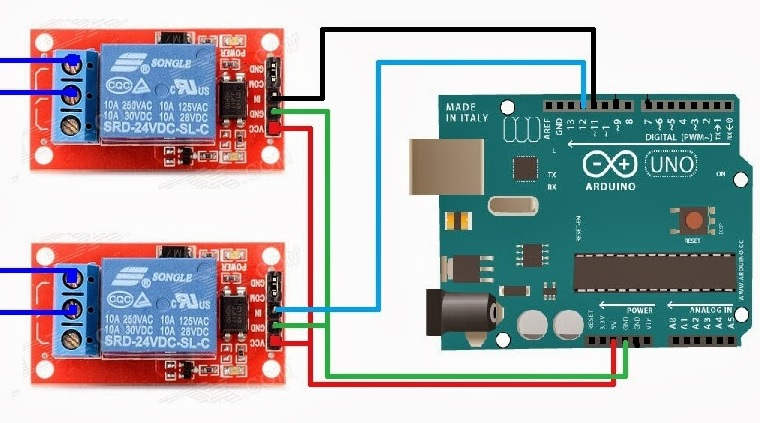

# emerging_tech_arduino

> Voorbeeld repository voor het praktijkgedeelte van het vak `emerging technologies`

- Arduino scripts kan je vinden in [code/arduino](./code/arduino/)
- Python scripts kan je vinden in [code/python](./code/python/)

Afbeeldingen plaats je in [imgs](./imgs/)
Bijv. 

## Bedradingsschema

## indien Project GGO

indien je reeds project GGO hebt, heb je waarschijnlijk al een algemene `README.md`, dan kun je extra documentatie in een aparte markdown file steken zoals hier in [emerging_tech.md](./emerging_tech.md)